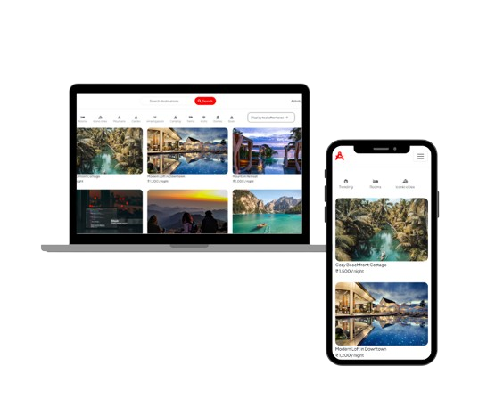

<h2 align="center">
  wandrlust - an Airbnb clone v2.0 
  <a href="https://wanderlust-project-dbgu.onrender.com/listings" target="_blank">wanderlust - an Airbnb clone</a>
</h2>

  

 

 &nbsp;
 &nbsp;
 &nbsp;
 &nbsp;

I am thrilled to share my first project, <a href="https://wanderlust-project-dbgu.onrender.com/listings" target="_blank">wanderlust</a> – an Airbnb Clone that replicates essential functionalities of the platform. It was developed using a wide range of technologies and packages, which helped bring this project to life.

This project was built using these technologies.

- HTML5, CSS3, Boostrap
- Express.js & Node.js: For backend server-side logic.
- MongoDB: For database management.
- Passport.js: Integrated for user authentication.
- Passport Local: For local login.
- Passport Facebook & Passport Google OAuth20: For social logins.
- Passport Local Mongoose: To simplify local authentication with MongoDB.
- Cloudinary: For image storage and management.
- Mapbox: For interactive maps, allowing users to visualize listing locations.
- Connect Flash: To display flash messages to users.
- Connect Mongo: For session storage.
- Cookie Parser: For parsing cookies for session management.
- Dotenv: To manage environment variables securely.
- EJS: For rendering dynamic templates on the server-side.
- Express Session: For handling user sessions.
- Joi: For validating data inputs.
- Mongoose: Object Data Modeling for MongoDB.
- Multer: To handle file uploads.

## Features

**📖 Multi-Page Layout**

**🎨 Styled with Bootstrap and Css with easy to customize colors**

**📱 Fully Responsive**

**🔑 User Authentication: Implemented Login, Logout, and User Profile sections.**

**➕ CRUD Operations: Users can Add, Edit, and Delete listings.**

**🗑️ Review System: Users can add and delete reviews for each listing.**

**👤 Account Management: Users can update their account details and change their password.**

**🔐 User Data Security: Passwords are hashed and encrypted for security.**

## Challenges & Solutions

Faced data handling and scalability issues, but I overcame them by implementing a well-architected backend and efficient data management strategies

### Show your support

Give a ⭐ if you like this website!

